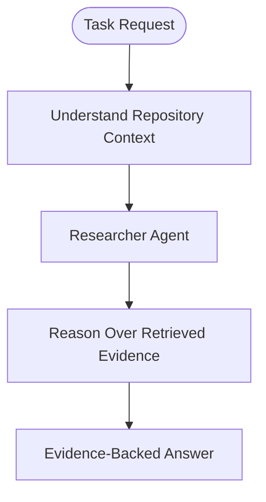
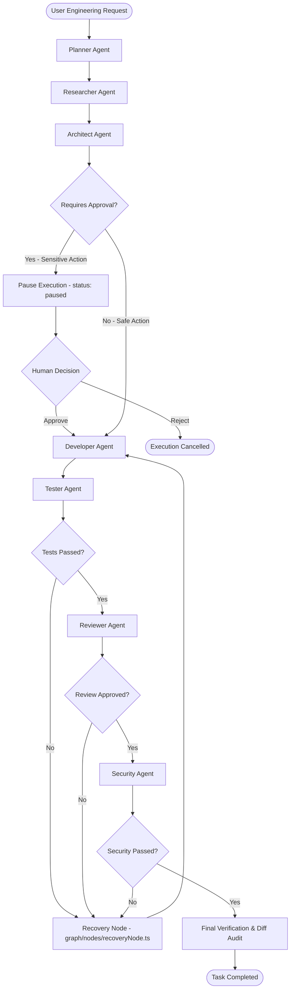

# Aegis Agent Execution & Workflow Flow

This document details the execution flows, dynamic handoff routing, failure recovery loops, and human-in-the-loop approval gates in **Aegis**.

---

## 1. Core Agent Lifecycle & Execution Patterns

Aegis agents do not operate as simple one-shot LLM prompts. Every agent follows a structured **Reason → Act → Observe → Update State** execution pattern:

```text
┌─────────────────────────────────────────────────────────────┐
│                       INPUT TASK                            │
└──────────────────────────────┬──────────────────────────────┘
                               │
                               ▼
                    ┌─────────────────────┐
                    │     LLM REASON      │
                    └──────────┬──────────┘
                               │
                       Requires Tool Call?
                       /               \
                     YES                NO
                      │                  │
                      ▼                  ▼
             ┌────────────────┐  ┌───────────────┐
             │ EXECUTE TOOL   │  │ RETURN RESULT │
             └────────┬───────┘  └───────────────┘
                      │
                      ▼
             ┌────────────────┐
             │ OBSERVE OUTPUT │
             └────────┬───────┘
                      │
                      └────────→ Back to LLM REASON
```

---

## 2. Dynamic Execution Workflows

Aegis routing is state-driven and task-dependent (`graph/edges/agentRouter.ts`). Not every request executes every node.

### A. Non-Modifying / Investigation Workflow (e.g., *"Why is authentication failing?"*)
For queries requesting explanation, investigation, or code lookup without proposing changes:



---

### B. Full Engineering Change Workflow (e.g., *"Fix authentication bug"*)
For tasks proposing software modifications across the full lifecycle:



---

## 3. Failure Recovery & Iteration Loops (`graph/nodes/recoveryNode.ts`)

When tests fail (`testResults.passed === false`) or code review rejects a proposed diff:
1. Execution routes to `recoveryNode` rather than restarting the entire workflow.
2. `recoveryNode` extracts the failing agent, error reasons, and test logs, incrementing `retryCount`.
3. It constructs a structured `RecoveryContext` and appends it to `AegisStateAnnotation`.
4. Execution routes back to `Developer` (for implementation fixes) or `Architect` (for structural re-design).
5. If `retryCount` exceeds `maxRetries` (default 3), execution terminates safely with `status: "failed"`, logging full error history.

```text
    Developer Agent → Tester Agent → [TEST FAILURE]
                           │
                           ▼
                    recoveryNode (graph/nodes/recoveryNode.ts)
                           │
             (Increments retryCount & appends RecoveryContext)
                           │
                           ▼
                    Developer Agent (Receives test failure context)
                           │
                           ▼
                    Tester Agent → [TEST PASSED] → Reviewer Agent
```

---

## 4. Human-in-the-Loop Approval Gate (`graph/approvalWorkflow.ts`)

For sensitive mutations (file deletions, terminal commands, production database migrations, GitHub branch/commit creations):

```text
    Agent Proposes Action
             │
             ▼
    tools/guardrails/policyEngine.ts (evaluatePermission)
             │
     Action Category?
     ├── ALLOW → Execute tool immediately
     ├── BLOCK → Deny immediately (ERR_DANGEROUS_ACTION_BLOCKED)
     └── REQUIRE_APPROVAL
             │
             ▼
    graph/approvalWorkflow.ts (approvalCheckGateNode)
             │
             ▼
    Pause Execution (status: "paused", checkpoint saved via MemorySaver)
             │
             ▼
    User Prompted: [APPROVE] or [REJECT]
             │
             ├── APPROVE → Resumes graph execution, performs change, proceeds
             └── REJECT  → Resumes graph execution, prevents change, logs refusal, ends cleanly
```

---

## 5. State Annotations & Data Flow (`graph/state.ts`)

The central `AegisStateAnnotation` tracks all lifecycle data:

```typescript
export const AegisStateAnnotation = Annotation.Root({
  task: Annotation<string>(),
  status: Annotation<ExecutionStatus>(), // "planning" | "researching" | "architecting" | "developing" | "testing" | "reviewing" | "securing" | "paused" | "completed" | "failed"
  plan: Annotation<PlanStep[]>(),
  research: Annotation<ResearchFinding[]>(),
  architecture: Annotation<ArchitectureResult>(),
  codeChanges: Annotation<CodeChange[]>(),
  testResults: Annotation<TestResult[]>(),
  reviewResults: Annotation<ReviewResult[]>(),
  securityAudit: Annotation<SecurityResult>(),
  pendingApproval: Annotation<ApprovalRequest | undefined>(),
  approvalDecision: Annotation<ApprovalDecision | undefined>(),
  recoveryContext: Annotation<RecoveryContext | undefined>(),
  errors: Annotation<string[]>(),
  retryCount: Annotation<number>(),
  maxRetries: Annotation<number>(),
});
```