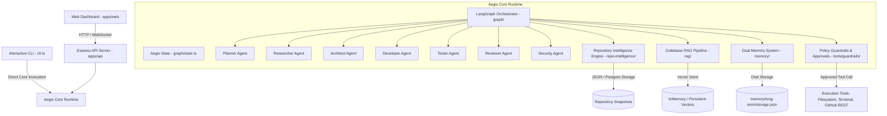

# Aegis System Architecture

> **Job**: *How AEGIS is architected*

This document describes the technical architecture, component design, state routing model, and subsystem relationships of **AEGIS**.

---

## 1. System Architecture Overview

AEGIS is architected around a central **StateGraph Orchestrator** powered by LangGraph, binding specialized agents, project knowledge RAG, dual memory stores, repository intelligence, and security policy guardrails into a single runtime.



---

## 2. Component Design & Subsystem Breakdown

### 2.1 Agent Layer (`agents/`)
Aegis deploys 7 specialized agents operating under a standardized `BaseAgent` abstraction:
- **Planner Agent (`agents/planner/`)**: Decomposes high-level engineering intent into structured plan steps.
- **Researcher Agent (`agents/researcher/`)**: Investigates codebase patterns, file structures, and documentation.
- **Architect Agent (`agents/architect/`)**: Designs component boundaries, API schemas, and database changes.
- **Developer Agent (`agents/developer/`)**: Generates production-ready file edits and code implementations.
- **Tester Agent (`agents/tester/`)**: Constructs and executes automated test suites.
- **Reviewer Agent (`agents/reviewer/`)**: Performs code review for maintainability, diff correctness, and regressions.
- **Security Agent (`agents/security/`)**: Audits code changes for vulnerabilities, injection risks, and secret exposure.

### 2.2 LangGraph Orchestration & State Layer (`graph/`)
- **State Management (`graph/state.ts`)**: Central state annotation (`AegisStateAnnotation`) tracking user intent, plan steps, research findings, architecture designs, code changes, test results, review findings, security audits, recovery state, and approval status.
- **Dynamic Router (`graph/edges/agentRouter.ts`)**: Evaluates `AegisState` to dynamically route to the appropriate next agent, skipping redundant steps when artifacts are pre-populated.
- **Failure Recovery (`graph/nodes/recoveryNode.ts`)**: Captures test failures or review rejections and routes execution back to the Developer or Architect with structured `RecoveryContext` without restarting the workflow.

### 2.3 Repository Intelligence Engine (`repo-intelligence/`)
Constructs a revision-aware, evidence-backed model of connected codebases:
- **Scanner & Security**: Walks file trees, respects `.gitignore`, redacts secret tokens (`[REDACTED_SECRET]`), and isolates untrusted static content.
- **AST Parser (`repo-intelligence/parsers/tsParser.ts`)**: Uses `ts-morph` to extract exported/internal classes, methods, functions, interfaces, types, and line ranges.
- **Domain Extractors**: Extracts Express/Next.js API routes, SQL/Prisma database models, manifest dependencies, and test block targets.
- **Relationship Graph Engine**: Synthesizes provenanced code edges (`CALLS`, `IMPORTS`, `HANDLES`, `QUERIES`, `TESTED_BY`, `USES`) with line-level evidence and confidence ratings (`exact`, `inferred`).
- **Hybrid Retrieval & Impact Analysis**: Combines graph traversal with semantic RAG embeddings to compute change impact reports (`computeDynamicImpactReport`).

### 2.4 Codebase-Aware RAG Pipeline (`rag/`)
- **Pipeline (`rag/pipeline.ts`)**: Coordinates document loading, sliding-window text chunking, Gemini embeddings (`gemini-embedding-001`), and cosine similarity vector search.
- **Project Knowledge (`rag/projectKnowledge.ts`)**: High-level interface providing `ingestProject`, `ingestFiles`, `queryKnowledge`, `getFormattedContext`, and `enhanceContext`.

### 2.5 Dual Memory System (`memory/`)
- **Short-Term Memory (`memory/short-term/`)**: Execution-scoped, run-isolated working scratchpad (`runId`).
- **Long-Term Memory (`memory/long-term/`)**: Persistent epistemic knowledge store (`storage.json`) retaining project facts, architectural decisions, and coding guidelines across process restarts.

### 2.6 Safety & Human-in-the-Loop (`tools/guardrails/` & `graph/approvalWorkflow.ts`)
- **Policy Engine**: Categorizes actions into `ALLOW` (read-only), `REQUIRE_APPROVAL` (file mutations, terminal commands, database migrations), or `BLOCK` (dangerous system commands like `rm -rf /` or path escape `../../etc/passwd`).
- **Approval Gate**: Uses LangGraph `MemorySaver` checkpointer to pause execution (`status: "paused"`) when sensitive mutations are requested. Execution resumes only when a human explicitly approves the action.

### 2.7 Real GitHub Integration (`tools/github/`)
- **Real REST Data**: All production GitHub operations call `api.github.com` live using native fetch and authentication via `GITHUB_TOKEN` from `.env`. Zero fake/mock responses in production code.
- **Guardrail Enforced**: Branch creation, file commits, and PR creation pass through permission guardrails before network invocation. Secrets are strictly masked.

---

## 3. Data Flow & Communication Lifecycle

```text
User Request / Intent
       │
       ▼
CLI / API Gateway
       │
       ▼
Aegis Core Runtime (Initializes AegisState)
       │
       ▼
LangGraph StateGraph Orchestration
       ├── 1. Targeted Knowledge & Intelligence Retrieval (repo-intelligence + RAG)
       ├── 2. Specialized Multi-Agent Reasoning (Planner → Researcher → Architect)
       ├── 3. Safety & Policy Gate Evaluation (tools/guardrails/)
       ├── 4. Human Approval Interruption (if sensitive action requested)
       ├── 5. Controlled Execution (Developer Agent + Tools)
       ├── 6. Multi-Agent Verification (Tester → Reviewer → Security)
       └── 7. Failure Recovery Loop (if tests/reviews fail)
       │
       ▼
Evidence-Backed Result / Verified Code Diff
```

---

## 4. Current vs. Planned Architectural Components

| Component | Architecture Role | Status |
| :--- | :--- | :--- |
| Gemini Model Layer | LLM Integration & Structured Output | `[IMPLEMENTED]` |
| 7 Specialized Agents | Reasoning & Artifact Creation | `[IMPLEMENTED]` |
| LangGraph StateGraph | Stateful Workflow Orchestration | `[IMPLEMENTED]` |
| Failure Recovery Node | Contextual Failure Routing & Repair | `[IMPLEMENTED]` |
| Repository Intelligence | AST Graph & Impact Analysis | `[IMPLEMENTED]` |
| Codebase RAG & Memory | Context Retrieval & Fact Storage | `[IMPLEMENTED]` |
| Guardrails & Approval | Safety & Risk Policy Enforcement | `[IMPLEMENTED]` |
| Real GitHub Integration | Production REST Code Operations | `[IMPLEMENTED]` |
| CLI, API, & Dashboard | User & Developer Interfaces | `[IMPLEMENTED]` |
| Terminal Sandbox | Isolated Command Runner | `[IN PROGRESS]` |
| MCP Integration | Standardized Model Context Protocol | `[PLANNED]` |
| Session Resume/Rewind | Persistent State Checkpointing | `[PLANNED]` |
| Observability & Tracing | Run Telemetry & Cost Tracking | `[PLANNED]` |
| Evaluation Suite | Deterministic Quality Benchmarking | `[PLANNED]` |
| Architecture Simplification | Post-stability Non-breaking Consolidation | `[PLANNED]` |